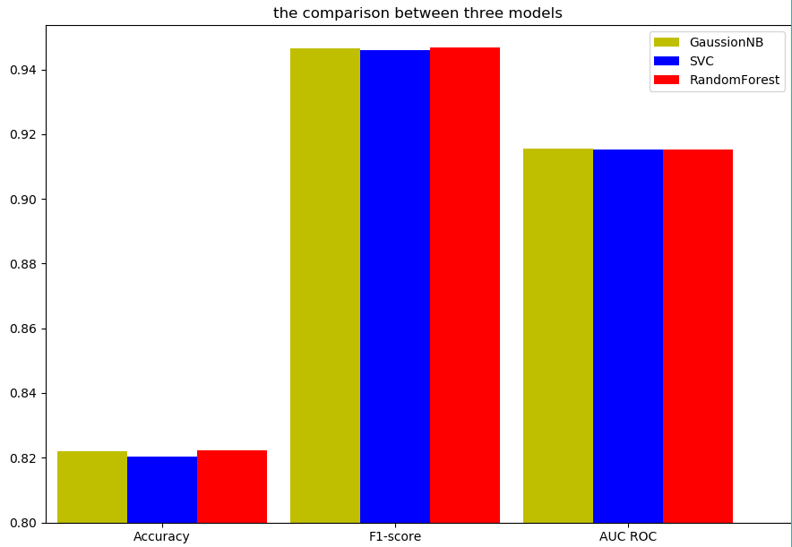

# sklearn综合使用（week16）

学号：16337237
姓名：王永锋

[toc]

在这一份报告中，我主要使用了sklearn中的datasets模块生成了一些数据，并以此为数据集，去分别训练了三个模型，同时对这三种模型参数的选取以及三种模型之间的横向比较进行一些说明。代码可见报告附录以及随报告一同打包的代码文件。


## 生成数据集

通过下面的代码，生成具有2000个样例, 每个样例具有20个特征的数据集。并且这个数据级大致具有2类。

```python
# generate the dataset
dataset = datasets.make_classification(
    n_samples=2000, n_features=10, 
    n_informative=2, n_redundant=2, 
    n_repeated=0, n_classes=2,
    random_state=3
    )
all_X = dataset[0]
all_y = dataset[1]

```

> 注意到在进行交叉验证的时候需要使用到AUC ROC方法，而AUC ROC方法对分类的要求必须是二分类。因此我创建的数据集也仅仅是分了两类。

## 对模型计算最终得分

对于不同模型得分的计算，我采取了这样的方式进行计算，详细代码可见附录。

1. 对同一份数据集，使用10折交叉验证进行模型的训练及计分
1. 每一次训练，对于参数可变的模型（如SVC，RandomForestClassifier），在每一次进行训练前先进行一次预训练，找到适合当前训练集的最佳参数（注意在确定最佳参数的过程中没有涉及到测试集的数据）
1. 确定最佳参数后，使用本次计算得到的最佳参数，和测试集进行训练，并使用该训练好的模型对测试集进行预测，得到预测数据。
1. 使用三种不同的方法，对预测数据和测试样例结果进行比对和打分，将分数存在一个临时的列表中。
1. 10折交叉验证结束后，该模型能够得到10个分数，将这10个分数取平均值，放到全局列表中，作为该模型的最终得分

## 使用交叉验证对模型性能进行评价

最终得到的数据，我使用条形图的方式进行绘制，如下图所示。由于数据过于接近，我还将准确的数据写在一个表上，以方便对比。发现三种模型的分数大致相当，不过从自己运行的时间感觉的话，`RandomForest`的训练时间明显比前两种时间长很多。

总结而言，对于我生成的这个模型，`SVC`模型似乎并不是特别适合，因为无论是哪一个分数，SVC模型都略微比其他模型低一点点。而相比起`GaussianNB`和`RandomForest`模型而言，从训练的速度来看，`RandomForest`模型训练速度大约是`GaussionNB`的三十多倍，最终的准确率与`GaussianNB`相近，因此`GaussianNB`模型在这里更加适合这个模型。





|模型名称|Accuracy|F1-score|AUC ROC|
|-|-|-|-|
|GaussianNB|0.8219999999999998 | 0.9465 | 0.9155000000000001|
|SVC|0.8204530575066038 | 0.9460194400287374 | 0.9151247358929064 |
|RandomForest|0.8221989746857277 | 0.9467659845032548 | 0.9152704449923229 |


## 附录

```python

# 加载数据集
from sklearn import datasets
from sklearn import cross_validation
from sklearn.naive_bayes import GaussianNB
from sklearn.svm import SVC
from sklearn.ensemble import RandomForestClassifier
from sklearn import metrics
import matplotlib.pyplot as plt
import numpy as np


Cvalues = [1e-2, 1e-1, 1e0, 1e1, 1e2]
n_estimators_values = [10, 100, 1000]


# generate the dataset
dataset = datasets.make_classification(
    n_samples=2000, n_features=20, 
    n_informative=8, n_redundant=2, n_repeated=0, 
    n_classes=2,
    random_state=6
    )
all_X = dataset[0]
all_y = dataset[1]


def GaussianNB_model(X_train, y_train, X_test):
    clf = GaussianNB()
    clf.fit(X_train, y_train)
    return clf.predict(X_test)

def rbf_svm_model(X_train, y_train, X_test, C):
    clf = SVC(C=C, kernel='rbf', class_weight='balanced')
    clf.fit(X_train, y_train)
    return clf.predict(X_test)

def RandomForestClassifier_model(X_train, y_train, X_test, n_estimators):
    clf = RandomForestClassifier(n_estimators=n_estimators)
    clf.fit(X_train, y_train)
    return clf.predict(X_test)


scores_acc = []
scores_f1 = []
scores_auc = []

clf_model = [GaussianNB_model, GaussianNB_model, RandomForestClassifier_model]


for i in range(3):
    """ 
    0 : GaussianNB
    1 : SVC
    2 : RandomForest
    """
    cur_acc = []
    cur_f1 = []
    cur_auc = []
    kf = cross_validation.KFold(len(all_X), n_folds=10, shuffle=True)
    for train_index, test_index in kf:
        # get train set and test set
        X_train, y_train = all_X[train_index], all_y[train_index]
        X_test, y_test = all_X[test_index], all_y[test_index]
        # get y_predict in best parameter
        if i == 0:
            # 如果是GaussionNB，不需要选择参数，可以直接计算结果
            y_predict = GaussianNB_model(X_train, y_train, X_test)
        else:
            # train the model and get the best parameter
            innerscore = []
            # 对于另外两种模型，需要指定参数列表和模型函数
            if i == 1 :
                parameters = Cvalues
                local_model = rbf_svm_model
            elif i == 2:
                parameters = n_estimators_values
                local_model = RandomForestClassifier_model
            for parameter in parameters:
                # parameter seletor
                ikf = cross_validation.KFold(len(X_train), n_folds=5, shuffle=True, random_state=33)
                innerf1 = []
                for t_index, v_index in ikf:
                    X_t, X_v = X_train[t_index], X_train[v_index]
                    y_t, y_v = y_train[t_index], y_train[v_index]
                    i_y_predict = local_model(X_t, y_t, X_v, parameter)
                    innerf1.append(metrics.f1_score(y_v, i_y_predict))
                innerscore.append(np.mean(innerf1))
            # 经过一个循环后，每一个参数的分数都存放在了innerscore列表中，此后取分数最高的参数进行预测
            bestParameter = parameters[np.argmax(innerscore)]
            print(bestParameter)
            # use the trained model to predict the output
            y_predict = local_model(X_train, y_train, X_test, bestParameter)
        # calculate the predict result score
        print(y_test)
        print(y_predict)
        cur_acc.append(metrics.accuracy_score(y_test, y_predict))
        cur_f1.append(metrics.f1_score(y_test, y_predict, average='macro'))
        cur_auc.append(metrics.roc_auc_score(y_test, y_predict))
    # 计算每一种方法的最终得分
    scores_acc.append(np.mean(cur_acc))
    scores_f1.append(np.mean(cur_f1))
    scores_auc.append(np.mean(cur_auc))

print(scores_acc, scores_f1, scores_auc)


name_list = ['Accuracy','F1-score','AUC ROC']  
x =list(range(3))  
total_width, n = 0.9, 3

width = total_width / n    
plt.bar(x, scores_acc, width=width, label='GaussionNB',fc = 'y')  
for i in range(len(x)):  
    x[i] = x[i] + width  
plt.bar(x, scores_f1, width=width, label='SVC', tick_label = name_list,fc = 'b')  
for i in range(len(x)):  
    x[i] = x[i] + width  
plt.bar(x, scores_auc, width=width, label='RandomForest',fc = 'r')  
plt.legend()  
plt.show()  

```